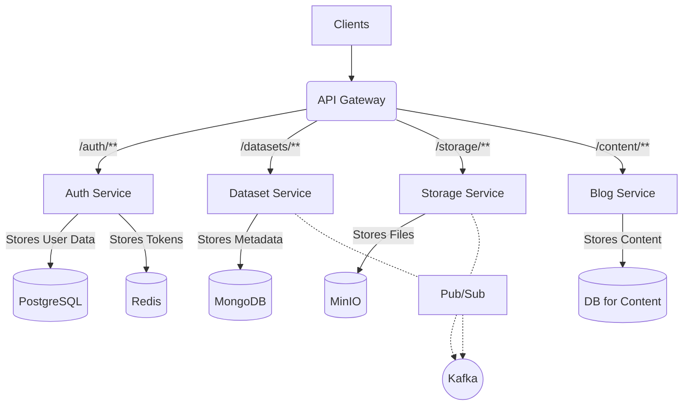

**Open Linked Hub** là nền tảng kết nối và chia sẻ dữ liệu mở. Phần **Backend** được xây dựng theo kiến trúc **Microservices**, chịu trách nhiệm xử lý logic nghiệp vụ, quản lý dữ liệu, xác thực người dùng, và cung cấp API an toàn cho các client (Frontend, Mobile App, ứng dụng bên thứ ba).

---

## 1. Mục tiêu 🎯

- **Cung cấp API ổn định & an toàn:** Xây dựng các endpoint RESTful và GraphQL bảo mật, hiệu quả để quản lý siêu dữ liệu dataset, xử lý file, và xác thực người dùng.
- **Kiến trúc Microservices linh hoạt:** Tách biệt các chức năng chính (Auth, Dataset, Storage...) thành các service độc lập, dễ dàng phát triển, triển khai và mở rộng.
- **Giao tiếp Bất đồng bộ:** Sử dụng Kafka để các service giao tiếp với nhau một cách hiệu quả, giảm thiểu sự phụ thuộc trực tiếp và tăng khả năng phục hồi.
- **Quản lý Dữ liệu Đa dạng:** Hỗ trợ lưu trữ dữ liệu có cấu trúc (PostgreSQL cho User), dữ liệu phi cấu trúc/linh hoạt (MongoDB cho Dataset metadata), và lưu trữ file lớn (MinIO).
- **Caching Hiệu quả:** Tận dụng Redis để cache dữ liệu thường xuyên truy cập (ví dụ: Refresh Token, thông tin user), giảm tải cho database và tăng tốc độ phản hồi.
- **Dễ dàng Triển khai:** Đóng gói toàn bộ hệ thống backend bằng Docker Compose, giúp việc cài đặt và chạy thử trên môi trường local trở nên đơn giản.

---

## 2. Thiết kế hệ thống 🏛️

Backend được thiết kế theo **Kiến trúc Microservices**. Các service chính bao gồm:

- **API Gateway:** Cổng vào duy nhất, xử lý routing, xác thực tập trung (sau này), và các tác vụ chung.
- **Auth Service:** Quản lý người dùng, đăng ký, đăng nhập, cấp và xác thực token (JWT/OAuth2). Sử dụng PostgreSQL.
- **Dataset Service:** Quản lý siêu dữ liệu (metadata) của các bộ dữ liệu. Sử dụng MongoDB và cung cấp API GraphQL/REST.
- **Storage Service:** Xử lý việc tải lên/tải xuống file dữ liệu thô. Tương tác với MinIO và Kafka.
- **(Tiềm năng) Blog/Content Service:** Quản lý nội dung tĩnh như tin tức, hướng dẫn.

Các service giao tiếp với nhau qua API trực tiếp (thông qua Gateway hoặc nội bộ) hoặc bất đồng bộ qua **Kafka**. **Redis** được dùng để caching và lưu trữ Refresh Token.



---

## 3. Cấu trúc dự án Backend 📁

```
backend/
├── api-gateway/         # Service API Gateway (Spring Cloud Gateway)
│   ├── src/
│   └── pom.xml
├── auth-service/        # Service Xác thực (Spring Security, OAuth2)
│   ├── src/
│   └── pom.xml
├── dataset-service/     # Service Quản lý Metadata (Spring Data MongoDB, GraphQL/REST)
│   ├── src/
│   └── pom.xml
├── storage-service/     # Service Lưu trữ File (Spring WebFlux, MinIO, Kafka) - Sẽ tạo
│   ├── src/
│   └── pom.xml
├── blog-service/        # Service Quản lý Nội dung (Spring Web, JPA) - Sẽ tạo
│   ├── src/
│   └── pom.xml
├── docker-compose.yml   # Định nghĩa môi trường Docker cho backend
└── pom.xml              # File POM cha quản lý các module backend
```

---

## 4. Cài đặt & Chạy dự án Backend 🚀

### Yêu cầu:

- **Java Development Kit (JDK):** ≥ 17
- **Apache Maven:** ≥ 3.8.x
- **Docker & Docker Compose:** Phiên bản mới nhất

### Cài đặt:

```bash
# Clone repository (nếu chưa có)
git clone https://github.com/Haui-HIT-NhoNguoiYeuCu/open-linked-hub.git
cd open-linked-hub/backend

# Build tất cả các service con bằng Maven
# (Lệnh này sẽ build từng module được khai báo trong pom.xml cha)
mvn clean install -DskipTests
```

### Biến môi trường

Các cấu hình kết nối database, Kafka, Redis, MinIO được định nghĩa chủ yếu trong file `backend/docker-compose.yml` và được truyền vào các container dưới dạng biến môi trường. Các file `application.yml` trong từng service sẽ ưu tiên đọc các biến này.

### Chạy chế độ phát triển (Sử dụng Docker Compose):

```bash
# Đảm bảo bạn đang ở thư mục backend/
# Khởi chạy tất cả các service hạ tầng và ứng dụng
docker-compose up --build -d
```

### Các service sẽ chạy tại các cổng tương ứng:

- **API Gateway:** 👉 http://localhost:8080
- **Dataset Service (Swagger):** 👉 http://localhost:8081/swagger-ui.html
- **Auth Service (Swagger):** 👉 http://localhost:8083/swagger-ui.html
- **MinIO Console:** 👉 http://localhost:9001
- **Kafka UI (nếu cài thêm):** ...
- **Eureka Dashboard (nếu cài thêm):** 👉 http://localhost:8761

### Để dừng các service:

```bash
docker-compose down
```
